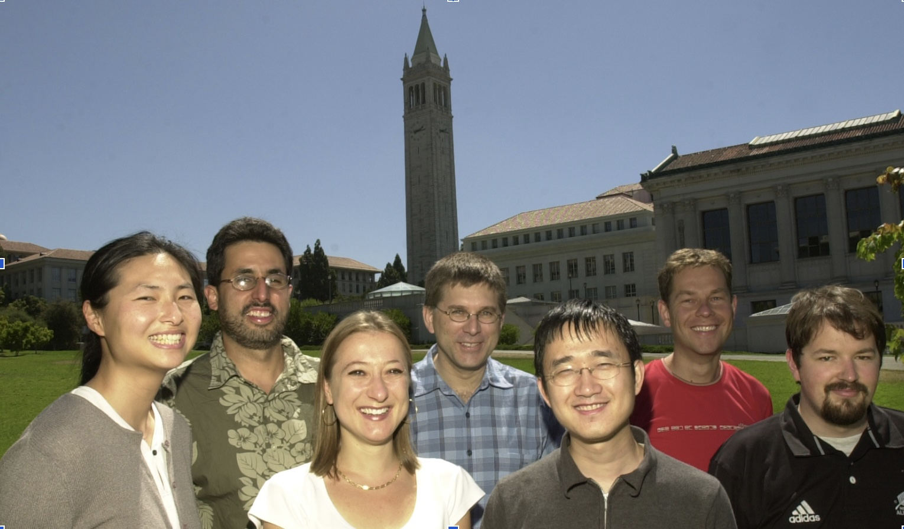
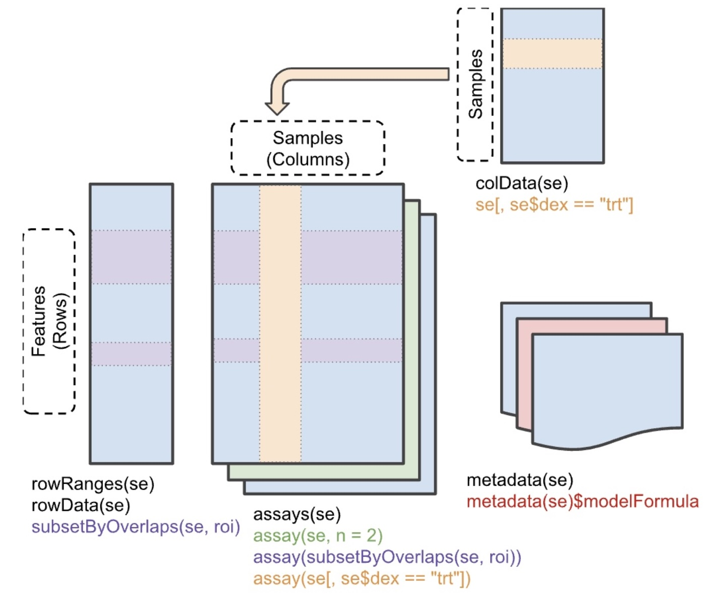

# Welcome to Bioconductor -- 25yo!

## Learning objectives for the first 45 minutes of the course

- tables and their annotation
- manipulating table contents with R
  - base R and brackets with matrices and data.frames
  - dplyr, tibbles, pipes
    - S4Vectors, DataFrame
- SummarizedExperiment, SingleCellExperiment
  - linking vectors, linking tables to improve efficiency and reliability
  - annotating tables to provide scientific interpretability 
    - RangedSummarizedExperiment
    - TreeSummarizedExperiment ([schema](https://github.com/vjcitn/csama26vjc/blob/ff147b9377bcedfcb7b0fc5b32ac94b0ef4c1c23/tseSchema.jpg))
    - SpatialFeatureExperiment ([schema](https://github.com/vjcitn/csama26vjc/blob/ff147b9377bcedfcb7b0fc5b32ac94b0ef4c1c23/sfeSchema.jpg))

## Thinking about and making tables (10 min)

- choosing rows and columns for information on a topic
  - form pairs of students, design tables on ways in which cancer or infectious disease has afffected your life
- annotating rows, columns, and "data" (the table-cell values)
- constructing a "dataset" from tables
- interpreting the dataset: role of conventions

## R programming for tables (10 min)

### Files

- basic representation: "file contents", consider csv format
- how does read.csv "behave"? Consider <https://tinyurl.com/s46cn7by>
  - ?read.csv provides the doc
- how does data.table::fread "behave"?
- what are we shooting for: easy interrogation and reshaping

### Numerical data

- let x be a `matrix`
- x[i,j] is a datum, x[i,] and x[,j] are vectors
- mixed type data: let x be a data.frame instance
  - x[i,] is a data.frame ("closure")
  - x[,j] is a vector -\> convenience
- dplyr concepts: let x be a tibble instance
  - x[i,] is a tibble ("closure")
  - x[,j] is a tibble ("closure")
  - filter and select and "pipe"
- How do tibble and S4Vectors::DataFrame differ?

## Bioconductor programming for tables arising in genomics (10 min)

- Why do we need special data structures for genomics?
  - quantification: matrices, especially sparse matrices for scRNA-seq
  - annotation: genes and samples can be annotated in arbitrarily fine detail
    - concept of a data "class":
- specific structures and operations guaranteed to "make sense" when applied to instances of the class
- "generic" methods reduce complexity of requirements on users

### Example: PlinkMatrix

We will use a "DelayedMatrix"

- `vignette("PlinkMatrix", package="PlinkMatrix")`
- `library(PlinkMatrix); pm = example_PlinkMatrix()`
- `pm[10,10]`
- compute PCA of a random sample?
